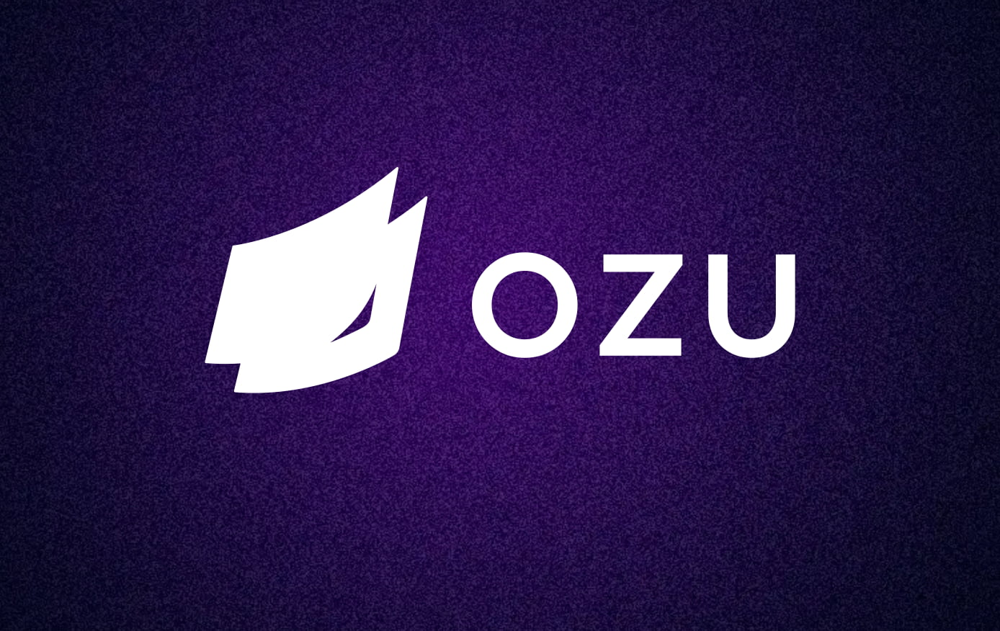

# Client companion for Ozu 

Ozu provides a simple and powerful tool to build static websites with dynamic content using your favorite Laravel stack.

The project is in private beta for now, but you can request access here: [ozu.code16.fr](https://ozu.code16.fr). You can also refer to [this blog post](https://code16.fr/posts/introducing-ozu-a-static-website-deployment-solution-for-laravel-projects/) to learn more about the project.

## Why Ozu?

For many projects, static websites are an ideal fit: they are fast, secure, and easy to maintain. However, they often lack easy content management, can be complex to deploy, and might require a different stack than a regular Laravel project.

Ozu addresses these issues by allowing you to build your website as a regular Laravel project and deploy it as a static website to Netlify or any other server.

As a bonus, Ozu provides a dedicated CMS for your customers to manage their website content without compromises.

## Documentation

You can find the documentation at [ozu.code16.fr/docs](https://ozu.code16.fr/docs).
